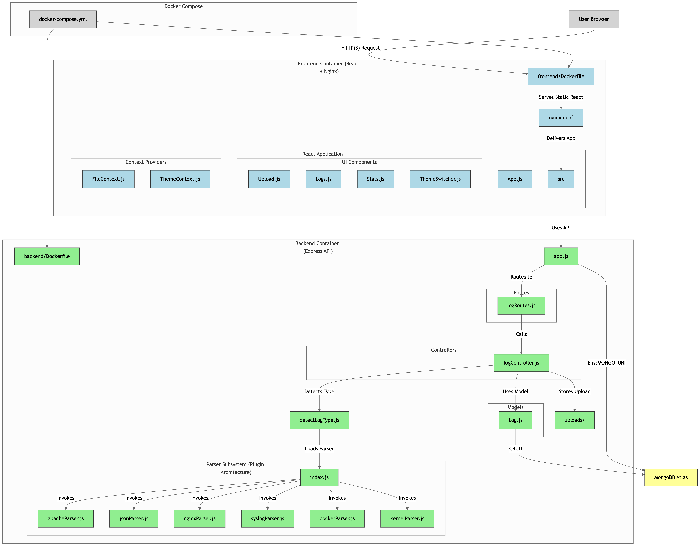
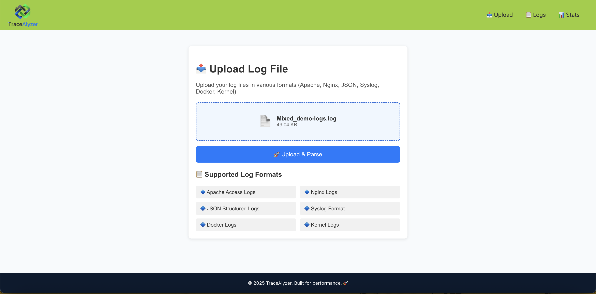
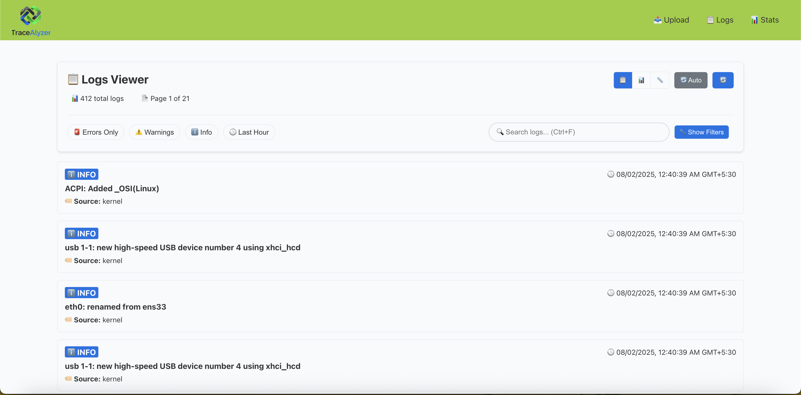
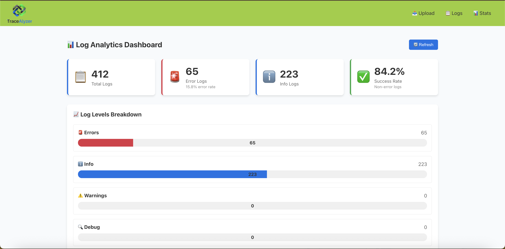

# 🧾 TraceAlyzer - Universal Log Parser

## Project Diagram

### 📊 Dashboard View



````markdown
A powerful and extensible log parsing web application built with the MERN stack. Supports real-time parsing, visualization, and querying of multiple log formats, including:

- Nginx Logs
- JSON Structured Logs
- Syslog Format
- Docker Logs
- Kernel Logs

Deployed via Docker Compose and using MongoDB Atlas as the cloud database backend.

---

## 🚀 Features

- 📄 Multi-format log parsing engine (pluggable architecture)
- 📊 Interactive web UI with real-time log updates
- 🔍 Advanced filtering, search, and pagination
- 🧩 Supports structured and unstructured log formats
- 📦 Dockerized with `docker-compose` for easy deployment
- ☁️ MongoDB Atlas integration for scalable storage

---

## 🛠️ Tech Stack

- **Frontend**: React + Tailwind + Chart.js
- **Backend**: Node.js + Express
- **Database**: MongoDB Atlas
- **Log Parsing**: Custom parsing logic per format
- **Deployment**: Docker, Docker Compose

---

## ⚙️ Prerequisites

- Docker + Docker Compose installed
- MongoDB Atlas connection string
- Node.js (if running locally without Docker)

---

## 📦 Installation

```bash
# Clone the repository
git clone https://github.com/your-username/log-parser.git
cd log-parser

# Create your .env file
cp .env.example .env
# Edit .env to add your MongoDB Atlas URI and other settings
````

---

## 🐳 Run with Docker Compose

```bash
# From root directory
docker-compose up --build
```

The frontend will be available at:
📍 `http://localhost:3000`

API will be running at:
📍 `http://localhost:5000`

---

## 🌐 Environment Variables (`.env`)

```env
MONGO_URI=mongodb+srv://<username>:<password>@cluster.mongodb.net/logs
```

---

## 🔍 Project Structure

```
├── backend/
│   ├── parsers/
│   │   ├── nginx.js
│   │   ├── json.js
│   │   ├── syslog.js
│   │   └── ...
│   ├── routes/
│   ├── controllers/
│   └── app.js
├── frontend/
│   ├── components/
│   ├── pages/
│   └── App.jsx
├── docker-compose.yml
├── Dockerfile
├── README.md
└── .env.example
```

---

## 🧪 Usage

1. Upload or stream log files via UI or API
2. Select parser (or auto-detect)
3. Filter logs by date, level, service, etc.
4. Visualize log trends with charts

---

## 🛡️ Future Roadmap

* [ ] User authentication and RBAC
* [ ] Log export (CSV, JSON)
* [ ] Alerting system (Slack, Email)
* [ ] Kubernetes log support
* [ ] Elasticsearch integration

---

## 🤝 Contributing

1. Fork the repo
2. Create your feature branch (`git checkout -b feature/foo`)
3. Commit your changes (`git commit -m 'Add some foo'`)
4. Push to the branch (`git push origin feature/foo`)
5. Open a pull request

---


## 🙋‍♂️ Author

**Shubham Nimkar**
🔗 [GitHub](https://github.com/shubnimkar)
🔗 [LinkedIn](https://www.linkedin.com/in/shubham-nimkar)

```
